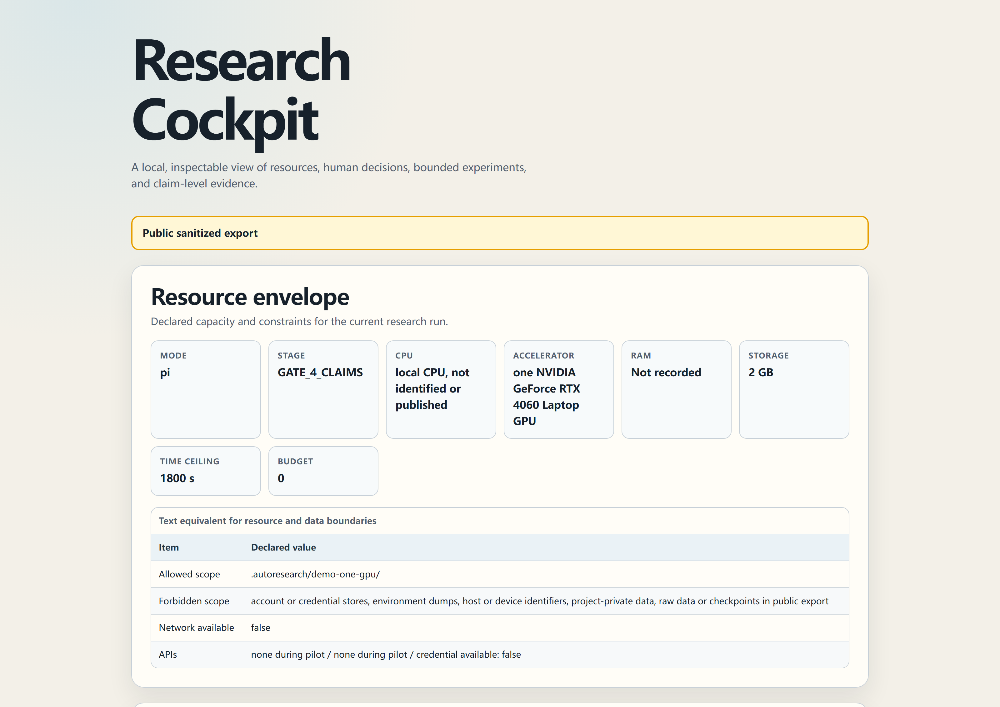

# ResearchHelm

**Human-governed research, from resources to audited claims.**

[](https://github.com/zhangyiCristino/researchhelm/actions/workflows/ci.yml)
[](https://github.com/zhangyiCristino/researchhelm/actions/workflows/security.yml)

ResearchHelm is **not an autonomous AI scientist**. It does not promise to turn a topic into a paper or replace scientific judgment. You remain the principal investigator: the agent gathers evidence, builds and verifies within approved limits, and ties every retained claim back to artifacts.

`resources -> defensible ideas -> human decisions -> bounded execution -> audited claims`

[中文说明](README.zh-CN.md)

## From resources to audited claims

The default `pi` workflow starts with your real envelope—compute, wall time, budget, data, licenses, code, expertise, and deadline—then moves through four explicit human gates:

1. **Idea:** decide which resource-feasible idea deserves investment.
2. **Plan and budget:** approve the preregistration, risks, and spending ceiling.
3. **Full run:** promote a verified pilot into a bounded experiment block, redirect it, or stop.
4. **Claims:** decide what the frozen evidence permits the project to say.

Silence is never approval. Each gate is bound to the current input hash, so an old decision cannot authorize changed code, data, scope, or cost.

## Offline Research Cockpit

The zero-dependency [Research Cockpit renderer](skills/researchhelm/scripts/render_cockpit.py) turns validated local run records into one self-contained HTML file. With networking disabled, it can audit the resource envelope, idea trade-offs and overlap, gate timeline, experiment cost/performance, and each claim's path to code, configuration, data, and artifacts.

The Gate-4-approved [one-GPU walkthrough](demo/one-gpu-public/) is now available as a sanitized public package with frozen code, configuration, split rules, aggregate metrics, claims, hashes, and a self-contained [Cockpit](demo/one-gpu-public/research-cockpit.html). It is a bounded product walkthrough, not a benchmark, novelty, SOTA, or universal-generalization claim.



## Install the standard skill folder

For clients recognized by the [`skills` CLI](https://github.com/vercel-labs/skills):

```bash
npx skills add zhangyiCristino/researchhelm --skill researchhelm
```

`skills` is a **third-party community installer**, not an official ResearchHelm runtime and not evidence of native client support. Its recognition of an install path establishes only the evidence label actually recorded in the compatibility registry.

## Try without installing

For clients supported by that same third-party community tool:

```bash
npx skills use zhangyiCristino/researchhelm@researchhelm
```

This command is also provided by the third-party community installer. It does not make the named client an officially supported or `Native-tested` ResearchHelm runtime.

## Existing Claude Code users

Version 3.0.0 renames every identifier from `autoresearch` to `researchhelm`; install the current plugin:

```text
/plugin marketplace add zhangyiCristino/researchhelm
/plugin install researchhelm@researchhelm
```

The manual copy workflow uses the renamed skill folder:

```bash
git clone https://github.com/zhangyiCristino/researchhelm.git
cp -r researchhelm/skills/researchhelm ~/.claude/skills/
```

Claude Code users invoke `/researchhelm`. Codex-oriented UI metadata lives in `skills/researchhelm/agents/openai.yaml`; that metadata is an adapter to the same canonical skill, not a separate protocol or an unsupported native-test claim.

## Legacy identifiers

<details>
<summary>v2 identifiers and legacy URLs — expand if you installed before v3.0.0 or saved the old address.</summary>

Version 3.0.0 renamed the internal identity from `autoresearch` to `researchhelm`. To migrate an existing installation, remove the old `autoresearch` plugin or copied skill folder, reinstall with the current commands above, and call `/researchhelm` where you previously used `/autoresearch`. The old install command `/plugin install autoresearch@autoresearch-skill` and the old marketplace name no longer exist. To resume existing runs, rename the project state directory: `mv .autoresearch .researchhelm`.

GitHub redirects the previous repository location to ResearchHelm for web and Git operations. Update saved URLs to `zhangyiCristino/researchhelm`; third-party installers are not guaranteed to follow GitHub redirects. Do not reuse the old repository name. These v2-era commands are recorded for reference only and no longer match the current tree:

```text
/plugin marketplace add zhangyiCristino/autoresearch-skill
git clone https://github.com/zhangyiCristino/autoresearch-skill.git
cp -r autoresearch-skill/skills/autoresearch ~/.claude/skills/
npx skills add zhangyiCristino/autoresearch-skill --skill autoresearch
npx skills use zhangyiCristino/autoresearch-skill@autoresearch
```

</details>

## Portable bootstrap for other agents

Download or clone the **complete repository**. Downloading only `SKILL.md` is unsupported because its relative references, scripts, and assets are part of the contract. A capable coding agent needs local file reading, shell execution, and Git; if any capability is missing, it must report the gap and stop.

Give the agent this bootstrap, replacing `<download-path>` with the extracted or cloned location:

```text
Read <download-path>/skills/researchhelm/SKILL.md completely.
Resolve every relative reference from that skill directory.
Check that you can read files, execute commands, and use Git.
Use pi mode unless I explicitly request scout or optimize.
Do not cross a human decision gate without my approval.
```

Offline agents may analyze user-supplied sources or run an approved local optimization. They must not claim that they searched public papers, code, or datasets when no public search occurred. The `pi` above is a research mode, not a compatibility claim about the Pi client.

## Three modes

- **`pi` (default):** the complete human-governed lifecycle, from resource scouting through audited claims.
- **`scout`:** resource intake, landscape and overlap diligence, and decision-ready ideas; it stops at Gate 1 without writing experiment code.
- **`optimize` (legacy compatible):** the original bounded single-metric loop—`modify -> verify -> keep/discard -> repeat`—with branch isolation, a frozen evaluator, commit-before-verify, truthful crash rows, and Git-backed provenance.

Ambiguous scientific work goes to `pi`. Only an explicit scalar objective with an agreed evaluator, scope, and budget goes to `optimize`.

## Why this is different

- **Resource-to-idea scouting:** feasibility and falsification cost come before a seductive idea.
- **Builder-Verifier supervision:** the Builder implements; an independent Verifier checks scope, evaluator integrity, artifacts, and anomalous gains.
- **Bounded autonomous blocks:** approval grants only a defined hypothesis, editable scope, evaluator, budget, retry policy, and stop conditions.
- **Claim-to-artifact auditing:** a metric alone is not a scientific claim; retained conclusions must trace to immutable evidence and disclose uncertainty and alternatives.

## Evidence-backed compatibility

The public table below is generated from [`evals/compatibility/clients.json`](evals/compatibility/clients.json). It is not a client-count claim. Open each evidence link for the operating system, exact command, limitations, and tested commit. Rows older than the registry policy become `needs revalidation`.

<!-- COMPATIBILITY:START -->
| Client | Label | Version | Tested | Evidence |
|---|---|---|---|---|
| Canonical Agent Skills folder | Standard-validated | GitHub CLI 2.96.0 preview | 2026-07-16 | [evidence](TESTING.md) |
<!-- COMPATIBILITY:END -->

Label meanings:

- **Standard-validated:** the canonical folder passed a format validator; this is a repository-format claim, not a native-client claim.
- **Install-path verified:** the pinned third-party installer discovered and copied or linked the skill to a selected path; this is not native support.
- **Native-tested:** a real client completed installation, discovery, activation, human-gate refusal, and safe exit.
- **Portable-tested:** a client without native installation followed the portable bootstrap and passed the shared behavior scenario.
- **Community-reported:** the report includes required reproducibility evidence but has not been independently reproduced by the maintainer.

Installer support counts never become ResearchHelm support counts. A portable fallback is available for capable coding agents, but no claim here says that every agent works.

## Credential, privacy, and publication boundary

ResearchHelm is scoped to the project workspace and user-approved paths. It must not inspect Claude Code or Codex account/configuration directories, browser profiles, Git credential helpers, SSH/GPG keys, cloud credential files, operating-system credential stores, session databases, or a complete environment-variable dump. API authentication remains opaque and host-managed; records may state only the provider and whether authentication was available, never a credential value or credential-derived hash.

Local Cockpits are private and untracked by default. A committed public Cockpit must come from a validated sanitized public export. Newly recommended skills inherit the same boundary and cannot be installed or used merely because they were recommended.

**Dated scope (2026-07-15):** deterministic state, privacy, public export, Cockpit, compatibility, repository contracts, and the bounded one-GPU walkthrough are recorded in [TESTING.md](TESTING.md). Reachable-history sanitization, exact release-archive scanning, an independent credential scanner, and remote publication remain later release gates. No software can promise absolute security; this project does not claim it. See [SECURITY.md](SECURITY.md) for private reporting and incident handling.

## Demo, governed recommendations, migration, and project links

### Demo status

The public walkthrough completed all four human gates and 18 frozen runs on UCI Covertype. In this exact dataset/model/split protocol, matched-random macro-F1 exceeded whole-area-holdout macro-F1 in all nine paired area-and-seed comparisons; the mean paired difference was `+0.211`. The evidence is limited to this setup, and the measured GPU time (`646 s`) is budget evidence rather than a performance benchmark. Inspect the [claim ledger and immutable artifacts](demo/one-gpu-public/) instead of trusting the summary.

### Governed Skill Recommendations

When a concrete capability gap appears, ResearchHelm may show up to three evidence-backed Recommendation Cards, preferring an already installed equivalent and always offering a no-new-skill option. Every newly introduced skill requires approval of its exact source, immutable version or commit, content hash, permissions, data boundary, and stage constraints **before** installation or use. A changed hash or permission set invalidates the old approval.

### Migrating from v1 and v2

Version 3.0.0 completes the ResearchHelm rename: the plugin, marketplace, skill folder, command, and run-state directory now all use the `researchhelm` identity (see [Legacy identifiers](#legacy-identifiers)). The mechanical `optimize` protocol keeps its original safety semantics and `autoresearch/<tag>` branch naming. Routing is unchanged from v2: `pi` is the default for research, `scout` stops after idea diligence, and `optimize` is selected only for an explicitly bounded scalar objective.

### Verify and contribute

- Test evidence and limitations: [TESTING.md](TESTING.md)
- Compatibility evidence reports: [compatibility report form](.github/ISSUE_TEMPLATE/compatibility-report.yml)
- Security reports: [SECURITY.md](SECURITY.md), never a public issue containing sensitive material
- Canonical protocol: [`skills/researchhelm/SKILL.md`](skills/researchhelm/SKILL.md)

Issues and pull requests are welcome when they include reproducible, sanitized evidence. Community compatibility reports stay `Community-reported` until independently reproduced.

Protocol inspiration: [karpathy/autoresearch](https://github.com/karpathy/autoresearch). Released under the [MIT License](LICENSE).
