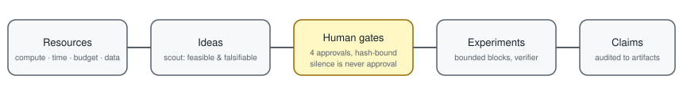
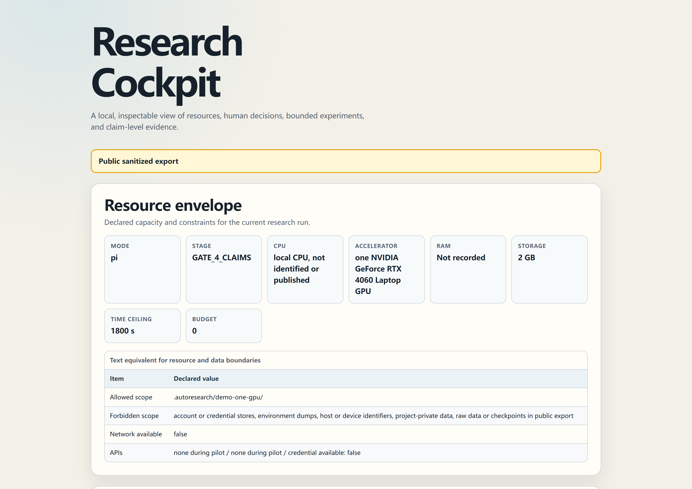
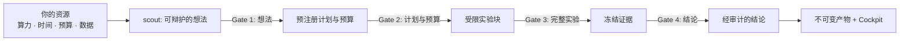

# ResearchHelm

**人主导科研：从现有资源走向可审计结论。**

[](https://github.com/zhangyiCristino/researchhelm/actions/workflows/ci.yml)
[](https://github.com/zhangyiCristino/researchhelm/actions/workflows/security.yml)
[](https://github.com/zhangyiCristino/researchhelm/releases)
[](LICENSE)
[](https://zhangyiCristino.github.io/researchhelm/)



ResearchHelm **不是自主 AI 科学家**，也不承诺把一个题目自动变成论文，更不会替代科研判断。你始终是负责人：Agent 在获批边界内搜集证据、构建、验证，并把每条保留结论追溯到具体产物。

`资源 -> 可辩护的想法 -> 人的决策 -> 受限执行 -> 经审计的结论`

[English README](README.md)

## 什么是 ResearchHelm？

ResearchHelm 是一套**人主导的科研协议**，面向具备读写文件、执行命令和使用 Git 能力的编码 Agent。它先把你的真实约束——算力、时间、预算、数据、许可证、代码、经验和截止日期——转化为可辩护的想法，再把获批的想法变成受限实验，让每条保留结论都能追溯到不可变证据。

它适合**希望用 AI 提速、但不想交出控制权的研究者与工程师**：每道门都是人的决定，沉默不等于批准，旧批准不能授权已改变的代码、数据、范围或成本。

## 快速上手

三种方式进入，同一套协议：

| 方式 | 适用场景 |
|---|---|
| `npx skills use zhangyiCristino/researchhelm@researchhelm` | 不安装直接试用（社区安装器） |
| 下文 Claude Code 插件命令 | 现有 Claude Code 用户 |
| 下文手动复制 Skill 目录 | 任意具备能力的编码 Agent |

第一次使用？先跑 `scout`：它把你的资源梳理成可直接决策的想法，并在编写任何实验代码之前停下。

## 在线演示

打开**净化后的单 GPU 走查**——零依赖、自包含的 Research Cockpit 页面，可审计资源边界、决策时间线、实验成本，以及每条结论通向代码、配置、数据和产物的证据链：

[**https://zhangyiCristino.github.io/researchhelm/**](https://zhangyiCristino.github.io/researchhelm/)



## 工作原理



每条箭头都经过**人类决策门**。Agent 提议；你批准；证据绑定到精确的输入哈希。

## 从资源到经审计的结论

默认的 `pi` 模式先了解真实约束——算力、时间、费用、数据、许可证、代码、经验和截止日期——再经过四道人类决策门：

1. **想法：**决定哪个在资源上可行的方向值得投入。
2. **计划与预算：**批准预注册方案、风险和费用上限。
3. **完整实验：**根据已验证的小规模试验，决定进入受限实验块、调整方向或停止。
4. **结论：**决定冻结的证据究竟允许项目表达什么。

沉默不等于批准。每次批准都绑定当前输入哈希；代码、数据、范围或成本改变后，旧批准不能继续使用。

## 离线 Research Cockpit

零依赖的 [Research Cockpit 渲染器](skills/researchhelm/scripts/render_cockpit.py) 会把验证后的本地运行记录生成一个自包含 HTML。即使断网，它也能审计资源边界、想法的取舍与重叠、决策时间线、实验成本与表现，以及每条结论通向代码、配置、数据和产物的证据链。

经过 Gate 4 批准的[单 GPU 演示](demo/one-gpu-public/)现已提供净化公共包，其中包含冻结代码、配置、拆分规则、聚合指标、结论、哈希和自包含 [Cockpit](demo/one-gpu-public/research-cockpit.html)。它是受限产品演示，不是基准、创新性、SOTA 或普遍泛化声明。


## 安装标准 Skill 文件夹

如果你的客户端可被 [`skills` CLI](https://github.com/vercel-labs/skills) 识别，可以运行：

```bash
npx skills add zhangyiCristino/researchhelm --skill researchhelm
```

`skills` 是**第三方社区安装器**，不是 ResearchHelm 官方运行时，也不能证明某个客户端获得了原生支持。安装器能识别一个路径，只能支持兼容性注册表中实际记录的那一级证据。

## 不安装，直接试用

对于该第三方社区工具支持的客户端：

```bash
npx skills use zhangyiCristino/researchhelm@researchhelm
```

这条命令同样来自第三方社区安装器；它不会让某个客户端自动成为官方支持或 `Native-tested` 的 ResearchHelm 运行时。

## 现有 Claude Code 用户

3.0.0 版把所有标识符从 `autoresearch` 更名为 `researchhelm`；请安装当前插件：

```text
/plugin marketplace add zhangyiCristino/researchhelm
/plugin install researchhelm@researchhelm
```

手动复制方式使用更名后的 Skill 目录：

```bash
git clone https://github.com/zhangyiCristino/researchhelm.git
cp -r researchhelm/skills/researchhelm ~/.claude/skills/
```

Claude Code 用户调用 `/researchhelm`。面向 Codex 的界面元数据位于 `skills/researchhelm/agents/openai.yaml`；它只是同一份规范 Skill 的薄适配层，不是第二套协议，也不代表未经验证的原生兼容性。

## Legacy identifiers

<details>
<summary>v2 标识符与旧仓库地址(v3.0.0 之前安装过、或保存过旧地址再展开)</summary>

3.0.0 版把内部标识从 `autoresearch` 更名为 `researchhelm`。迁移现有安装：先移除旧的 `autoresearch` 插件或手动复制的 Skill 目录，再用上面的当前命令重新安装，并在原本使用 `/autoresearch` 的地方改用 `/researchhelm`。旧安装命令 `/plugin install autoresearch@autoresearch-skill` 和旧 marketplace 名已不存在。要继续既有运行，请重命名项目内状态目录：`mv .autoresearch .researchhelm`。

GitHub 会把旧仓库位置的网页和 Git 操作重定向到 ResearchHelm。请把保存的地址更新为 `zhangyiCristino/researchhelm`；第三方安装器不保证遵循 GitHub 重定向。不要重新占用旧仓库名。下列 v2 时期命令仅作历史参考，已不匹配当前目录树：

```text
/plugin marketplace add zhangyiCristino/autoresearch-skill
git clone https://github.com/zhangyiCristino/autoresearch-skill.git
cp -r autoresearch-skill/skills/autoresearch ~/.claude/skills/
npx skills add zhangyiCristino/autoresearch-skill --skill autoresearch
npx skills use zhangyiCristino/autoresearch-skill@autoresearch
```

</details>

## 给其他 Agent 的可移植引导

请下载或克隆**完整仓库**。只下载 `SKILL.md` 不受支持，因为相对引用、脚本和资源也是契约的一部分。可执行此工作流的编码 Agent 必须能读取本地文件、执行 shell 命令并使用 Git；缺少任一能力时，应报告缺口并停止。

把下面内容交给 Agent，并用解压或克隆位置替换 `<download-path>`：

```text
Read <download-path>/skills/researchhelm/SKILL.md completely.
Resolve every relative reference from that skill directory.
Check that you can read files, execute commands, and use Git.
Use pi mode unless I explicitly request scout or optimize.
Do not cross a human decision gate without my approval.
```

离线 Agent 可以分析用户提供的资料，也可以执行已批准的本地优化；没有进行公开检索时，不得声称搜索过公开论文、代码或数据集。这里的 `pi` 是科研模式，不是对 Pi 客户端的兼容性声明。

## 三种模式

- **`pi`（默认）：**从资源侦察到结论审计的完整人主导科研生命周期。
- **`scout`：**完成资源盘点、公开格局与重叠核查，给出可决策的想法；在 Gate 1 停止，不编写实验代码。
- **`optimize`（兼容旧版）：**保留原有的受限单指标循环——`修改 -> 验证 -> 保留/丢弃 -> 重复`——以及分支隔离、冻结评估器、先提交后验证、如实记录崩溃和 Git 溯源。

含糊的科研任务进入 `pi`。只有明确给出标量目标、评估器、范围和预算时，才进入 `optimize`。

## 与常见端到端自动科研叙事的区别

- **资源到想法的侦察：**先审视可行性和证伪成本，再谈诱人的方向。
- **Builder-Verifier 监督：**Builder 负责实现；独立 Verifier 检查范围、评估器完整性、产物和异常提升。
- **受限自主实验块：**批准只覆盖已定义的假设、可改范围、评估器、预算、重试规则和停止条件。
- **结论到产物的审计：**一个指标不是科研结论；保留的表达必须能追溯到不可变证据，并公开不确定性和其他解释。

## 基于证据的兼容性

下表由 [`evals/compatibility/clients.json`](evals/compatibility/clients.json) 生成，不是客户端数量宣传。打开每行证据，可查看操作系统、精确命令、限制和被测提交。超过注册表时效的记录会变为 `needs revalidation`。

<!-- COMPATIBILITY:START -->
| Client | Label | Version | Tested | Evidence |
|---|---|---|---|---|
| Canonical Agent Skills folder | Standard-validated | GitHub CLI 2.96.0 preview | 2026-07-16 | [evidence](TESTING.md) |
<!-- COMPATIBILITY:END -->

标签含义：

- **Standard-validated（标准已验证）：**规范文件夹通过格式验证；这是仓库格式结论，不是客户端原生结论。
- **Install-path verified（安装路径已验证）：**固定版本的第三方安装器发现 Skill，并复制或链接到所选路径。**安装路径已验证不等于原生支持**。
- **Native-tested（原生测试）：**真实客户端完成安装、发现、激活，并验证其在未获批准时拒绝越过人类决策门后安全退出。
- **Portable-tested（可移植测试）：**没有原生安装能力的客户端按照可移植引导通过共享行为场景。
- **Community-reported（社区报告）：**报告包含要求的复现证据，但**社区报告不等于维护者独立复现**。

安装器支持数量不能转化成 ResearchHelm 支持数量。我们为具备必要能力的编码 Agent 提供可移植后备方案，但不会宣称所有 Agent 都能工作。

## 凭据、隐私与发布边界

ResearchHelm 只在项目工作区和用户明确批准的路径内工作。它不得检查 Claude Code 或 Codex 的账号/配置目录、浏览器资料、Git 凭据助手、SSH/GPG 私钥、云凭据文件、操作系统凭据库、会话数据库，也不得枚举完整环境变量。API 认证保持不透明并由宿主管理；记录最多写明服务提供方和认证是否可用，绝不记录凭据值或由凭据派生的哈希。

本地 Cockpit 默认属于私有、非跟踪文件。可提交的公开 Cockpit 必须来自经过验证的净化公共导出。新推荐的 Skill 继承相同边界，不能因为“被推荐”就自动安装或使用。

**检查范围日期（2026-07-15）：**确定性状态、隐私、公共导出、Cockpit、兼容性、仓库契约和受限单 GPU 演示记录在 [TESTING.md](TESTING.md)。可达历史净化、精确发布归档扫描、独立凭据扫描和远程发布仍是后续门禁。任何软件都不能承诺消除全部安全风险，本项目也不会作无边界声明。私密报告和事件处理见 [SECURITY.md](SECURITY.md)。

## 演示、受控推荐、迁移与项目链接

### 演示状态

公开演示已经完成四道人类决策门和 18 次冻结的 UCI Covertype 运行。在这一个明确的数据集、模型和拆分协议中，类别计数匹配的随机拆分在 9/9 个区域与 seed 配对中都高于整区域留出，平均配对差值为 `+0.211`。该证据只适用于本设置；实测 GPU 时间（`646 s`）是预算证据，不是性能基准。请直接检查[结论账本和不可变产物](demo/one-gpu-public/)，不要只相信摘要。

### 受控 Skill 推荐

当当前阶段出现具体能力缺口时，ResearchHelm 最多展示三张有证据的推荐卡，优先考虑已安装的等价 Skill，并始终提供“不新增 Skill”选项。每个新引入 Skill 的精确来源、不可变版本或提交、内容哈希、权限、数据边界和阶段限制，都必须在安装或使用**之前**获得批准；哈希或权限变化会使旧批准失效。

### 从 v1 / v2 迁移

3.0.0 版完成 ResearchHelm 更名：插件、marketplace、Skill 目录、命令和运行状态目录统一使用 `researchhelm` 标识（见 [Legacy identifiers](#legacy-identifiers)）。机械式 `optimize` 协议保留原有安全语义和 `autoresearch/<tag>` 分支命名。路由与 v2 相同：科研默认进入 `pi`，`scout` 在想法核查后停止，`optimize` 只处理明确受限的标量目标。

### 验证与贡献

- 测试证据与限制：[TESTING.md](TESTING.md)
- 兼容性证据报告：[兼容性报告表](.github/ISSUE_TEMPLATE/compatibility-report.yml)
- 安全报告：[SECURITY.md](SECURITY.md)，切勿在公开 Issue 中提交敏感材料
- 规范协议：[`skills/researchhelm/SKILL.md`](skills/researchhelm/SKILL.md)

欢迎提交带有可复现、已净化证据的 Issue 和 Pull Request。社区兼容性报告在维护者独立复现前始终保持 `Community-reported`。

## 常见问题

**与 karpathy/autoresearch 有什么区别？**

ResearchHelm 以测试优先的方式泛化了 `修改 -> 验证 -> 保留/丢弃 -> 重复` 循环：增加资源到想法的侦察、四道人类决策门、Builder-Verifier 分工和结论到产物的审计。原循环保留为受限的 `optimize` 模式。

**ResearchHelm 是自主 AI 科学家吗？**

不是。你始终是负责人：Agent 在获批边界内搜集证据、构建、验证，并把每条保留结论追溯到具体产物。沉默不等于批准。

**需要 GPU 吗？**

不需要。协议天然感知资源；单 GPU 演示把 GPU 时间作为预算证据报告，而不是硬件要求。

**能用于非科研任务吗？**

`optimize` 模式用于有明确标量目标、已商定评估器、范围和预算的任务；含糊的科研任务进入 `pi`。

**如何判断结论可信？**

查看 [TESTING.md](TESTING.md)、[`demo/one-gpu-public/`](demo/one-gpu-public/) 下的冻结产物与 CI 中的发布审计。任何软件都不能承诺消除全部安全风险，本项目也不会作无边界声明。

**如何贡献？**

欢迎提交带可复现、已净化证据的 Issue 和 Pull Request，见 [CONTRIBUTING.md](CONTRIBUTING.md)。

协议灵感来自 [karpathy/autoresearch](https://github.com/karpathy/autoresearch)。项目采用 [MIT License](LICENSE)。
